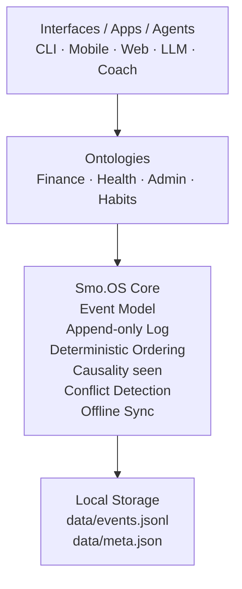
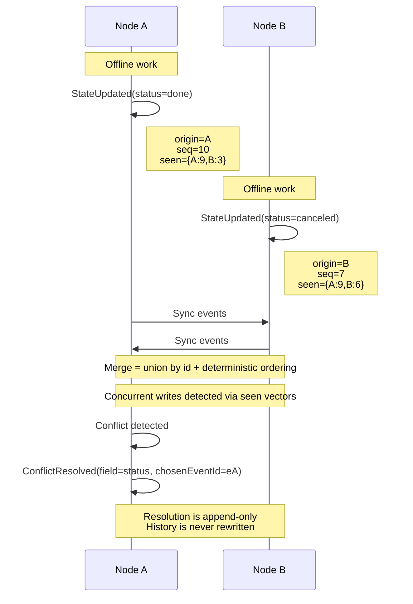

# Smo.OS — Smooth Personal Life Operating System

Smo.OS is an experimental implementation of a Personal Life Operating System (PLOS).

It provides a minimal, open and sovereign protocol to persist, synchronize and resolve personal cognitive state using an append-only event log.

## Core Idea

Your tools change.
Your cognition should not.

Smo.OS separates state persistence, synchronization and conflict handling from applications, AI agents or interfaces.

It acts as an infrastructure layer — not a productivity app.

## Core Principles

- Append-only event model
- Deterministic ordering
- Offline-first synchronization
- Causal conflict detection
- Append-only conflict resolution
- No interpretation layer (structure ≠ intelligence)

Specification:
→ `docs/protocol/plos-core.md`

---

## Architecture

Smo.OS follows a layered architecture where applications and AI agents sit above a minimal sovereign core.



## Offline Synchronization & Conflict Resolution

Smo.OS nodes can operate fully offline.

Synchronization merges event logs deterministically.
Conflicts are detected using causal concurrency instead of timestamps.


## Why Smo.OS Converges

- Deterministic ordering guarantees identical replay everywhere
- Causal detection (seen) identifies real offline conflicts
- Append-only resolution preserves history and sovereignty

## Security Layer (v0.2.1)

Smo.OS includes a cryptographic integrity layer for local storage.

Event logs are rotated into immutable, signed segments.

Each segment:

- Is deterministically ordered
- Uses canonical JSON (`json-stable-v1`)
- Builds a Merkle tree (`SHA-256`)
- Produces a root hash
- Is signed using Ed25519
- Is chained to previous segments

Security specification:
→ `docs/protocol/security-v0.2.1.md`

## Conformance

Smo.OS includes a deterministic conformance test suite validating distributed merge,    
canonical state projection (plos.core/* only), conflict detection and resolution, idempotence,  
timestamp tie-breaking, causal ordering via seen, and preservation of unknown namespaces.  

Any implementation claiming Smo.OS compatibility must pass the conformance suite.

---

## Current Status

Core (v0.1.1)  
✅ Event-sourced core  
✅ Offline-first synchronization  
✅ Deterministic convergence  
✅ Causal conflict detection  
✅ Append-only conflict resolution  

Security (v0.2.1):  
✅ Segment rotation  
✅ Merkle integrity per segment   
✅ Signed manifests  
✅ Segment chaining  
✅ Strict verification    

POC stage — protocol stabilization in progress.

---

## Roadmap

Smo.OS evolves along four structural pillars:

### Integrity & Sovereignty  
- ✅ Segment rotation v0.2.1  
- ✅ Signed manifests v0.2.1  
- ⏳ External anchoring  
- ⏳ Key registry & rotation  

### Interoperability  
- ⏳ Transport protocol  
- ⏳ Portable bundles  
- ✅ Conformance test suite v0.3.0  
- ⏳ Namespaces & extension registry  

### Performance  
- ⏳ Snapshots  
- ⏳ Indexing  
- ⏳ Retention policies  

### Agent Runtime Safety  
- ⏳ Sandboxing  
- ⏳ Capability model  
- ⏳ Permission system  
- ⏳ Audit trail  

---

## Quick Start

Install dependencies:
```bash
npm install
```
Create an entity:
```bash
npm run dev create "Coach AI"
```
Update state:
```bash
npm run dev update <entityId> status=in_progress
```
List reconstructed state:
```bash
npm run dev list
```
Export full event log:
```bash
npm run dev export
```
## Conflict Resolution

List conflicts:
```bash
npm run dev conflicts
```
Resolve a conflict:
```bash
npm run dev resolve <entityId> <field> <chosenEventId>
```
Resolution never rewrites history.

## Crypto

Seal current buffer:
```bash
npm run crypto:seal
```
Verify segments:
```bash
npm run crypto:verify
```
This checks:

- Manifest version
- Supported algorithms
- Merkle integrity
- Signature validity
- Segment chain consistency


## Non-Goals

Smo.OS is not:
- an AI assistant
- a productivity application
- a cloud platform
- a centralized service

It is a protocol layer.

## Vision

Smo.OS explores a future where personal cognitive state is:

- portable
- interoperable
- sovereign
- AI-agnostic

## Contributing

Issues, ideas and experiments welcome.
