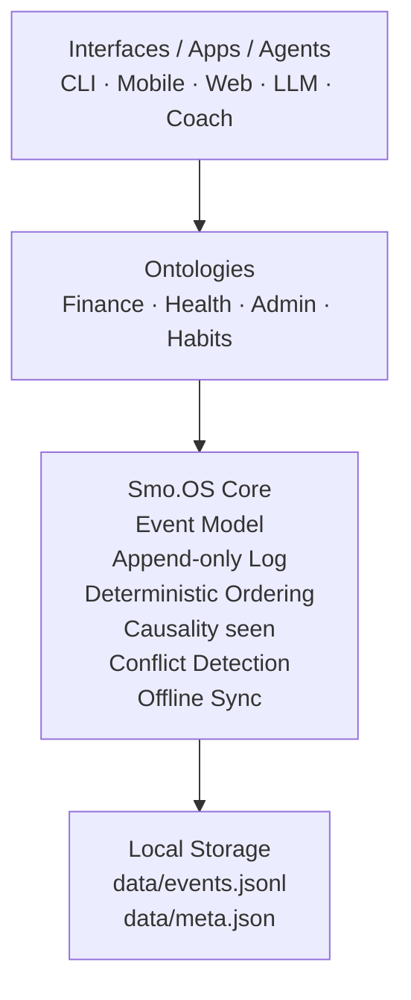
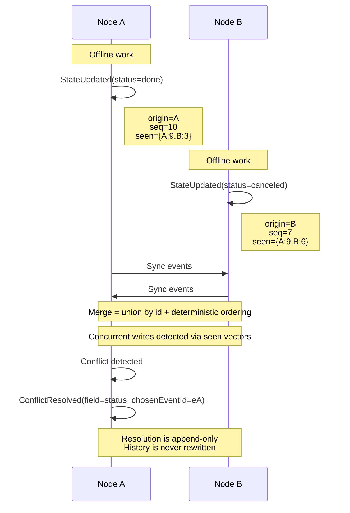

# Smo.OS — Smooth Personal Life Operating System

Smo.OS is an experimental implementation of a Personal Life Operating System (PLOS).

It provides a minimal, open and sovereign protocol to persist, synchronize and resolve personal cognitive state using an append-only event log.

## Core Idea

Your tools change.
Your cognition should not.

Smo.OS separates state persistence, synchronization and conflict handling from applications, AI agents or interfaces.

It acts as an infrastructure layer — not a productivity app.

## Core Principles

- Append-only event model
- Deterministic ordering
- Offline-first synchronization
- Causal conflict detection
- Append-only conflict resolution
- No interpretation layer (structure ≠ intelligence)

Specification:
→ `docs/protocol/plos-core.md`

---

## Architecture

Smo.OS follows a layered architecture where applications and AI agents sit above a minimal sovereign core.


```mermaid
flowchart TB

  I[Interfaces / Apps / Agents<br/>CLI · Mobile · Web · LLM · Coach]
  O[Ontologies<br/>Finance · Health · Admin · Habits]
  C[Smo.OS Core<br/>Event Model<br/>Append-only Log<br/>Deterministic Ordering<br/>Causality seen<br/>Conflict Detection<br/>Offline Sync]
  S[Local Storage<br/>data/events.jsonl<br/>data/meta.json]

  I --> O
  O --> C
  C --> S
```

## Offline Synchronization & Conflict Resolution

Smo.OS nodes can operate fully offline.

Synchronization merges event logs deterministically.
Conflicts are detected using causal concurrency instead of timestamps.

```mermaid
sequenceDiagram

  participant A as Node A
  participant B as Node B

  Note over A: Offline work
  A->>A: StateUpdated(status=done)
  Note right of A: origin=A<br/>seq=10<br/>seen={A:9,B:3}

  Note over B: Offline work
  B->>B: StateUpdated(status=canceled)
  Note right of B: origin=B<br/>seq=7<br/>seen={A:9,B:6}

  A->>B: Sync events
  B->>A: Sync events

  Note over A,B: Merge = union by id + deterministic ordering

  Note over A,B: Concurrent writes detected via seen vectors

  A->>A: Conflict detected
  A->>A: ConflictResolved(field=status, chosenEventId=eA)

  Note over A,B: Resolution is append-only<br/>History is never rewritten
```

## Why Smo.OS Converges

- Deterministic ordering guarantees identical replay everywhere
- Causal detection (seen) identifies real offline conflicts
- Append-only resolution preserves history and sovereignty

## Security Layer (spec 0.2.1)

Smo.OS includes a cryptographic integrity layer for local storage.

Event logs are rotated into immutable, signed segments.

Each segment:

- Is deterministically ordered
- Uses canonical JSON (`json-stable-v1`)
- Builds a Merkle tree (`SHA-256`)
- Produces a root hash
- Is signed using Ed25519
- Is chained to previous segments

Security specification:
→ `docs/protocol/security-v0.2.1.md`

External anchoring MVP specification:
→ `docs/protocol/external-anchoring-v0.1.md`

Key rotation workflow specification:
→ `docs/protocol/key-rotation-v0.1.md`

Versioning convention proposal:
→ `docs/protocol/versioning-convention.md`

Spec version baseline:
→ `docs/protocol/version-baseline.md`

## Conformance

Smo.OS includes a deterministic conformance test suite validating distributed merge,    
canonical state projection (plos.core/* only), conflict detection and resolution, idempotence,  
timestamp tie-breaking, causal ordering via seen, and preservation of unknown namespaces.  

Any implementation claiming Smo.OS compatibility must pass the conformance suite.

---

## Current Status

Core (spec 0.1.1)  
✅ Event-sourced core  
✅ Offline-first synchronization  
✅ Deterministic convergence  
✅ Causal conflict detection  
✅ Append-only conflict resolution  

Security (spec 0.2.1):  
✅ Segment rotation  
✅ Merkle integrity per segment   
✅ Signed manifests  
✅ Segment chaining  
✅ Strict verification    
✅ External anchoring (MVP)

POC stage — protocol stabilization in progress.

---

## How to validate changes  

Conformance globale (core + crypto):
```bash
npm run conformance
```

Conformance core (replay/merge semantics):
```bash
npm run conformance:core
```

Conformance crypto (agrégée):
```bash
npm run conformance:crypto
```

Conformance crypto spécifique (key policy):
```bash
npm run conformance:crypto:key-policy
```

Conformance crypto spécifique (anchor publish/verify policy):
```bash
npm run conformance:crypto:anchor
```

Conformance crypto spécifique (active->retired workflow):
```bash
npm run conformance:crypto:rotation
```

Transport protocol (serveur local):
```bash
npm run transport:serve -- --port 8787
```

Transport protocol (pull incremental):
```bash
npm run transport:pull -- --url http://127.0.0.1:8787/transport
```

Transport protocol (sandbox strict mode + policy):
```bash
npm run transport:serve -- --port 8787 --sandbox-policy ./docs/examples/sandbox-policy.example.json
```

Environment variables supported:
- `PLOS_SANDBOX_POLICY_PATH`
- `PLOS_SANDBOX_MODE` (`strict` by default, `compat` optional)

Policy supports either flat `rules` or layered `layers.system|workspace|session` (permission-system precedence).

Registry namespaces (validation):
```bash
npm run registry:validate
```

Registry namespaces (list):
```bash
npm run registry:list
```

---

## Roadmap

Smo.OS evolves along four structural pillars:

### Integrity & Sovereignty  
- ✅ Segment rotation spec 0.2.1  
- ✅ Signed manifests spec 0.2.1  
- ✅ External anchoring MVP spec 0.1.0
- ✅ Key registry spec 0.1.0 
- ✅ Key rotation workflows spec 0.1.0  

### Interoperability  
- ✅ Transport protocol spec 0.1.0 (draft + reference CLI/server: `docs/protocol/transport-protocol-spec-0.1.md`)  
- ✅ Portable bundles spec 0.1.0 (draft + CLI import/export: `docs/protocol/portable-bundles-spec-0.1.md`)  
- ✅ Conformance test suite spec 0.1.0  
- ✅ Namespaces & extension registry spec 0.1.0 (draft + registry CLI: `docs/protocol/namespaces-extensions-registry-spec-0.1.md`)  

### Performance  
- ⏳ Snapshots  
- ⏳ Indexing  
- ⏳ Retention policies  

### Agent Runtime Safety  
- ⏳ Sandboxing (draft spec: `docs/protocol/agent-runtime-sandboxing-spec-0.1.md`)  
- ⏳ Capability model (draft spec: `docs/protocol/agent-runtime-capability-model-spec-0.1.md`)  
- ⏳ Permission system (draft spec: `docs/protocol/agent-runtime-permission-system-spec-0.1.md`)  
- ⏳ Audit trail (draft spec: `docs/protocol/agent-runtime-audit-trail-spec-0.1.md`)  

---

## Quick Start

Install dependencies:
```bash
npm install
```
Create an entity:
```bash
npm run core:create -- "Coach AI"
```
Update state:
```bash
npm run core:update -- <entityId> status=in_progress
```
List reconstructed state:
```bash
npm run core:list
```
Export full event log:
```bash
npm run core:export
```
## Conflict Resolution

List conflicts:
```bash
npm run core:conflicts
```
Resolve a conflict:
```bash
npm run core:resolve -- <entityId> <field> <chosenEventId>
```
Resolution never rewrites history.

## Crypto

Seal current buffer:
```bash
npm run crypto:seal
```
Verify segments:
```bash
npm run crypto:verify
```

Publish anchor for latest segment:
```bash
npm run crypto:anchor
```

Verify anchor for latest segment:
```bash
npm run crypto:anchor:verify
```

Rotate active signing key:
```bash
npm run crypto:key:rotate
```

This checks:

- Manifest version
- Supported algorithms
- Merkle integrity
- Signature validity
- Segment chain consistency


## Non-Goals

Smo.OS is not:
- an AI assistant
- a productivity application
- a cloud platform
- a centralized service

It is a protocol layer.

## Vision

Smo.OS explores a future where personal cognitive state is:

- portable
- interoperable
- sovereign
- AI-agnostic

## Contributing

Issues, ideas and experiments welcome.
